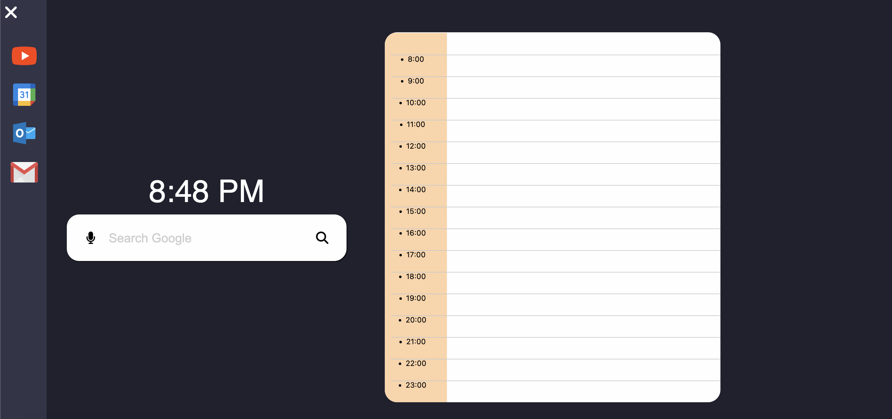

# [WORK IN PROGRESS]
# Better New Tab
### Description
Using Javascript, CSS, and HTML, I created a program that will enchance the default Google Chrome New Tab page. While it is still a work in progress, it currently has a working search bar, functional time blocker, and shortcuts to important websites. In the near future, I plan on implementing more widgets such as weather, text editor, calendar, or more.

